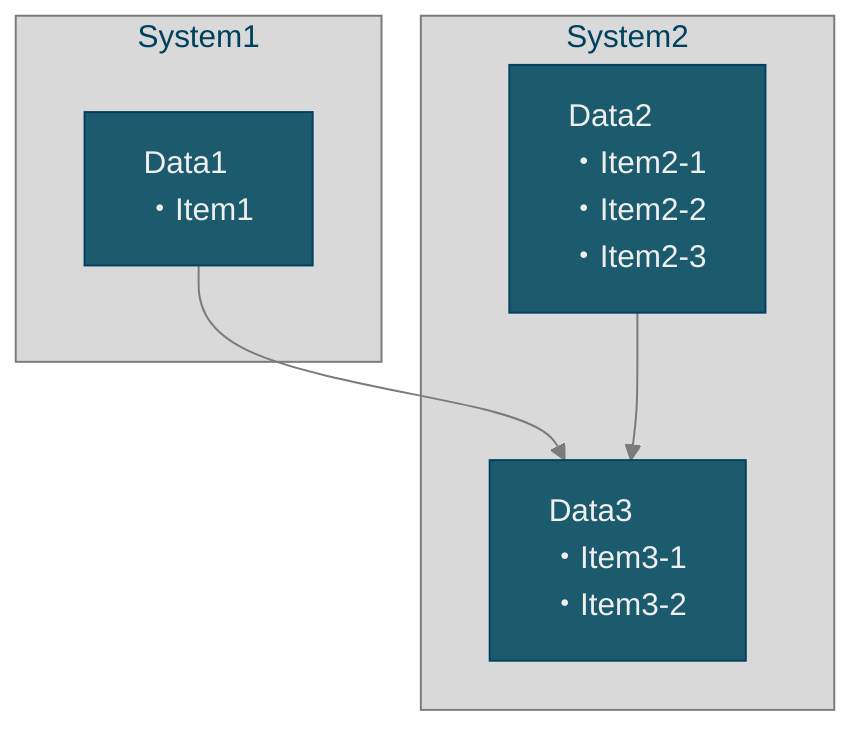

# 本ディレクトリについて

全社のデータと、データの管理主体、データ間の関連を可視化します。
SSOT (Single Source Of Truth) を重視した構造を模索します。

# 扱う要素について

## データ
ビジネス上の概念的としてひとまとまりのものを表わす。
データのうち、主要な特筆すべきものはこのドキュメントにおいて管理する。

## システム
データを管理する機能をシステムと呼ぶ。
1つのシステムが複数のデータを管理することもあるが、1つのデータが複数のシステムで管理することはSSOTの原則を破ることとなる

# 図の表記について

以下のようなMermaid 記法で表現するものとし、各要素ごとに、S_、D_ の接頭辞をつける。
ID部分には意味的な英単語を使用する。データの項目は ` ・項目名` 形式でラベル内に箇条書き表示する。

## 表記についての補足
<!-- ここから -->

「# 文章としての説明」セクションから「# 図示」セクションのMermaid図を生成する際は、以下の手順に従う。

### 1. システムとデータの変換

「## システム一覧」の各システム（### レベル）を `subgraph S_SystemName[システム名]` として定義する。
各システム内のデータ（#### レベル）を `D_DataName["データ名 ・項目1 ・項目2"]` としてノード定義する。

ID部分（`S_`、`D_` の後ろ）には意味的な英単語を使用する（例: `S_FreeeHR`, `D_Employee`）。

### 2. 関係性の定義

データ見出しに `<- データ名` がある場合（例: `#### 給与 <- 社員,勤怠`）、指定されたデータからそのデータへ矢印を引く（`D_Employee --> D_Salary`）。複数のデータを利用する場合はカンマ区切りで記載する。

### 3. スタイルの適用

すべての要素に対して、接頭辞に応じたクラスを適用する。
- `S_`: system
- `D_`: data

<!-- ここまで -->

# 文章としての説明

## 事業関連システム

### Slack

#### Daily Report
- 個人実績

### MMP

#### MMP案件情報
- 金額
- 期間
- 内容

#### Revenue Platform案件情報
- 予算枠
- 期間
- 内容

#### Revenue BPaaS案件情報
- 金額
- 期間
- 内容

#### MMP売上予測 <- MMPでの営業活動
- 金額
- 期間
- 内容

#### Revenue Platform売上予測 <- MMPでの営業活動
- 予算枠
- 期間
- 内容

#### Revenue BPaaS売上予測 <- MMPでの営業活動
- 金額
- 期間
- 内容

#### MMPでの営業活動
- 活動内容
- 活動数

#### MMPの利用設定 <- 案件管理(契約)
- 期間
- ID数

### AI SDR

#### Revenue Platform案件設定 <- 案件管理(契約)
- 単価
- 期間

#### Revenue Platformでの営業活動 <- MMPでの営業活動
- 成果

#### Revenue Platform 売上 <- 案件管理(契約),Revenue Platformでの営業活動
- 成果
- 金額

### Call Agent Hub

#### Revenue BPaaS案件設定
- 想定活動量
- 想定CVR

#### スケジュール管理 <- 社員
- 勤怠スケジュール

#### Call Agent実績 <- MMPでの営業活動
- 活動量
- 成果量

#### Call Agentアサイン <- Revenue BPaaS案件設定,スケジュール管理,勤怠,Call Agent実績,MMPでの営業活動
- アサイン情報

## 経営関連システム

### Freee人事労務

#### 社員
- 氏名
- 入社日
- 退社日

#### 勤怠
- 氏名
- 稼動

### Freee会計

#### 入金
- 入金日
- 金額

#### 経費
- 支払い日
- 金額

#### 給与 <- 社員,勤怠,人事評価
- 支払い日
- 金額
- 社員

#### 入金確認 <- 請求,入金
- 金額

### 古塚スペシャル

#### 人事評価 <- 社員,Daily Report
- 評価

### TrueOS

#### 予算
- 部門
- 用途
- 金額

#### 見積 <- MMP案件情報,Revenue BPaaS案件情報,Revenue Platform案件情報
- 金額
- 期間
- 内容

#### 案件管理(契約) <- 見積
- 金額
- 期間
- 内容

#### 売上予測 <- MMP売上予測,Revenue BPaaS売上予測,Revenue Platform売上予測
- 期間
- 金額

#### 請求 <- 案件管理(契約),Revenue Platform 売上
- 金額

#### 経営指標 <- 予算,経費,入金,給与,売上予測
- PL/BS
- 予実管理

# 図示

```mermaid
flowchart TD

    subgraph C_Business[事業関連システム]
        subgraph S_Slack[Slack]
            D_DailyReport["Daily Report<br/>・個人実績"]
        end

        subgraph S_MMP[MMP]
            D_MMPDealInfo["MMP案件情報<br/>・金額<br/>・期間<br/>・内容"]
            D_RPDealInfo["Revenue Platform案件情報<br/>・予算枠<br/>・期間<br/>・内容"]
            D_RBDealInfo["Revenue BPaaS案件情報<br/>・金額<br/>・期間<br/>・内容"]
            D_MMPSalesForecast["MMP売上予測<br/>・金額<br/>・期間<br/>・内容"]
            D_RPSalesForecast["Revenue Platform売上予測<br/>・予算枠<br/>・期間<br/>・内容"]
            D_RBSalesForecast["Revenue BPaaS売上予測<br/>・金額<br/>・期間<br/>・内容"]
            D_MMPSalesActivity["MMPでの営業活動<br/>・活動内容<br/>・活動数"]
            D_MMPSettings["MMPの利用設定<br/>・期間<br/>・ID数"]
        end

        subgraph S_AISDR[AI SDR]
            D_RPDealSettings["Revenue Platform案件設定<br/>・単価<br/>・期間"]
            D_RPSalesActivity["Revenue Platformでの営業活動<br/>・成果"]
            D_RPRevenue["Revenue Platform 売上<br/>・成果<br/>・金額"]
        end

        subgraph S_CallAgentHub[Call Agent Hub]
            D_RBDealSettings["Revenue BPaaS案件設定<br/>・想定活動量<br/>・想定CVR"]
            D_ScheduleManagement["スケジュール管理<br/>・勤怠スケジュール"]
            D_CallAgentResults["Call Agent実績<br/>・活動量<br/>・成果量"]
            D_CallAgentAssign["Call Agentアサイン<br/>・アサイン情報"]
        end
    end

    subgraph C_Management[経営関連システム]
        subgraph S_FreeeHR[Freee人事労務]
            D_Employee["社員<br/>・氏名<br/>・入社日<br/>・退社日"]
            D_Attendance["勤怠<br/>・氏名<br/>・稼動"]
        end

        subgraph S_FreeeAccounting[Freee会計]
            D_Deposit["入金<br/>・入金日<br/>・金額"]
            D_Expense["経費<br/>・支払い日<br/>・金額"]
            D_Salary["給与<br/>・支払い日<br/>・金額<br/>・社員"]
            D_DepositConfirmation["入金確認<br/>・金額"]
        end

        subgraph S_Furutsuka[古塚スペシャル]
            D_HRReview["人事評価<br/>・評価"]
        end

        subgraph S_TrueOS[TrueOS]
            D_Budget["予算<br/>・部門<br/>・用途<br/>・金額"]
            D_Estimate["見積<br/>・金額<br/>・期間<br/>・内容"]
            D_DealManagement["案件管理(契約)<br/>・金額<br/>・期間<br/>・内容"]
            D_SalesForecast["売上予測<br/>・期間<br/>・金額"]
            D_Invoice["請求<br/>・金額"]
            D_ManagementMetrics["経営指標<br/>・PL/BS<br/>・予実管理"]
        end
    end

    %% データ間の依存関係
    D_Employee --> D_Salary
    D_Attendance --> D_Salary
    D_HRReview --> D_Salary
    D_Invoice --> D_DepositConfirmation
    D_Deposit --> D_DepositConfirmation
    D_DealManagement --> D_MMPSettings
    D_DealManagement --> D_RPDealSettings
    D_DealManagement --> D_RPRevenue
    D_MMPSalesActivity --> D_MMPSalesForecast
    D_MMPSalesActivity --> D_RPSalesForecast
    D_MMPSalesActivity --> D_RBSalesForecast
    D_MMPSalesActivity --> D_CallAgentResults
    D_MMPSalesActivity --> D_RPSalesActivity
    D_RPSalesActivity --> D_RPRevenue
    D_MMPDealInfo --> D_Estimate
    D_RBDealInfo --> D_Estimate
    D_RPDealInfo --> D_Estimate
    D_Estimate --> D_DealManagement
    D_DealManagement --> D_Invoice
    D_RPRevenue --> D_Invoice
    D_MMPSalesForecast --> D_SalesForecast
    D_RBSalesForecast --> D_SalesForecast
    D_RPSalesForecast --> D_SalesForecast
    D_Budget --> D_ManagementMetrics
    D_Expense --> D_ManagementMetrics
    D_Deposit --> D_ManagementMetrics
    D_Salary --> D_ManagementMetrics
    D_SalesForecast --> D_ManagementMetrics
    D_Employee --> D_ScheduleManagement
    D_RBDealSettings --> D_CallAgentAssign
    D_ScheduleManagement --> D_CallAgentAssign
    D_Attendance --> D_CallAgentAssign
    D_CallAgentResults --> D_CallAgentAssign
    D_MMPSalesActivity --> D_CallAgentAssign
    D_Employee --> D_HRReview
    D_DailyReport --> D_HRReview

    classDef category fill:#efefef,stroke:#004160,color:#004160
    classDef system fill:#d9d9d9,stroke:#7b7b7f,color:#004160
    classDef data   fill:#1c5b6d,stroke:#004160,color:#efefef,text-align:left
    linkStyle default stroke:#7b7b7f

    class C_Business,C_Management category
    class S_Slack,S_FreeeHR,S_FreeeAccounting,S_MMP,S_AISDR,S_CallAgentHub,S_Furutsuka,S_TrueOS system
    class D_DailyReport,D_Employee,D_Attendance,D_Deposit,D_Expense,D_Salary,D_DepositConfirmation,D_MMPDealInfo,D_RPDealInfo,D_RBDealInfo,D_MMPSalesForecast,D_RPSalesForecast,D_RBSalesForecast,D_MMPSalesActivity,D_MMPSettings,D_RPDealSettings,D_RPSalesActivity,D_RPRevenue,D_RBDealSettings,D_ScheduleManagement,D_CallAgentResults,D_CallAgentAssign,D_HRReview,D_Budget,D_Estimate,D_DealManagement,D_SalesForecast,D_Invoice,D_ManagementMetrics data
```

<!-- ここから -->

<!-- ここまで -->
